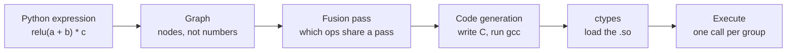

# Forge

A machine learning library written from scratch in Python, with a deep learning compiler that generates C.

No PyTorch, no TensorFlow, no NumPy in the core. Every operation, from the autograd engine to the attention mechanism, is implemented from first principles. The compiler on top of it analyses computation graphs, fuses operations, and emits optimised C at run time.

---

## What is here

**A differentiable tensor library.** Reverse-mode automatic differentiation on a define-by-run graph, a typed memory backend, and broadcasting that follows NumPy semantics without depending on NumPy.

**A neural network framework.** A `Module` system with automatic parameter registration, layers, optimisers, and loss functions.

**A decoder-only transformer.** Multi-head causal self-attention, LayerNorm, GELU, learned positional encoding, and pre-norm residual blocks, all built on the autograd engine above and gradient-checked individually.

**Hardware backends.** Matrix multiplication dispatches to the Apple Metal GPU, to Apple Accelerate BLAS on the CPU, or to a pure Python fallback, chosen by problem size.

**A deep learning compiler.** A separate front end that builds a graph, plans operator fusion, generates C source, compiles it with gcc, and loads it back through ctypes.

**Monte Carlo option pricing.** Derivatives priced on the tensor library, including the random number generation, and checked against the closed-form answers where those exist.

---

## Results

### Shakespeare

A 550,977-parameter GPT trained on the 1.11M-character tinyshakespeare corpus, using data-parallel training across 8 CPU cores.

| | |
|---|---|
| Model | 4 layers, 4 heads, 128 dimensions |
| Training | 33,113 steps, roughly 8 hours |
| Loss | 3.66 to 1.44 (character-level cross-entropy) |

The model learns Shakespeare's structure and register from raw characters, with no hand-coded rules:

```
ROMEO:
You will make him to her hell fame:
Be false and by the news of him.
Thou hast not late with my loath oCld,

NORTHUMBERLAND:
To the likely faint with my name are whose inecius:
I cannot know your grace; I and my heart!
```

It learned the style, not the meaning. Words wander and lines do not resolve, which is the honest ceiling for a model this size. Real coherence needs roughly two orders of magnitude more parameters.

<details>
<summary><b>Watch it learn</b></summary>

Samples taken during the run, showing what the model had worked out at each point. Nothing about play structure was ever specified.

**Step 1,000.** Letter frequencies and word lengths. No words.

```
Nos sor nore and thee. Kacefrar, sand a air to a trimeng ow brage;
Be cives'd suee ie fie icires eater,
```

**Step 2,000.** It discovers that plays have named speakers, and invents one.

```
OLIZABETH:
The heave in withat's mairest shis shalll weere pooosinessour centery
```

**Step 3,000.** Reaching for a real character name, and nearly getting there.

```
CORIONUS:
What you sumbled?
```

**Step 33,113.** Real speakers, verse structure, archaic register.

```
ROMEO:
You will make him to her hell fame:
Be false and by the news of him.
```

</details>

### Option pricing

A call option pays the amount a share finishes above an agreed level, and nothing if it finishes below. That payout, `max(price - strike, 0)`, is exactly ReLU, so the whole pricing routine runs as a chain of tensor operations the library already had.

The method is simulation. Generate a few hundred thousand possible futures for the share price, work out the payout in each, average them, and discount back to today.


Six views of 200,000 simulated futures. Red paths finish above the strike and pay out, grey ones expire worthless. The fan shows the range of outcomes widening with time, which is why an option costs anything at all. The gold bars in the last panel are the payouts themselves.

Priced with a share at 100, a strike of 100, 20% volatility, 5% interest, one year to expiry:

| Option | Simulated | Exact |
|---|---|---|
| Ordinary call | 10.4525 | 10.4506 |
| Asian, ordinary average | 5.8696 | no formula exists |
| Asian, geometric average | 5.6532 | 5.6411 |
| Barrier, knocked out at 130 | 3.8233 | no formula used |

The ordinary call and the geometric Asian both have closed forms, so the simulation can be checked rather than trusted. Once it agrees with those, the same machinery handles the two that have no formula at all, which is the entire reason banks run these.

The prices also behave the way they should. Averaging smooths the journey, so a lucky spike at expiry is diluted by every other observation and both Asian options come out cheaper than the ordinary one. A barrier at 130 cancels a large share of the paths that would have paid best, leaving the option worth 37% of the ordinary call.

Random draws from a bell curve come from the Box-Muller transform, implemented from the formula, since the library has no dependency that provides them.

### Compiler

Measured on an Apple M4 Max. Every optimised path is verified to produce output identical to the unoptimised path before it is timed.

| Optimisation | Workload | Before | After | Speedup |
|---|---|---|---|---|
| Operator fusion | 16M elements | 8.1ms | 3.4ms | 2.33x |
| Cache-blocked matmul | 768 x 768 | 349.1ms | 32.1ms | 10.88x |
| Both, 4-layer MLP | 256 x 256 | 43.1ms | 4.8ms | 8.94x |

Against BLAS, called through NumPy, on the same machine:

| Size | Naive | Compiled | BLAS | Compiled, slower by |
|---|---|---|---|---|
| 256 x 256 | 10.7ms | 1.2ms | 0.02ms | 49x |
| 512 x 512 | 97.1ms | 11.6ms | 0.17ms | 69x |
| 768 x 768 | 348.4ms | 32.1ms | 0.27ms | 117x |

The compiled matmul reaches about 28 GFLOPS against BLAS's 3.4 TFLOPS. The gap is SIMD and multithreading, neither of which is implemented yet.

---

## Quick start

```bash
git clone https://github.com/SrihariSr/Forge.git
cd Forge
```

Nothing to install for the core library. Python 3.10 or later.

### Tensors and gradients

```python
from Forge import Tensor

a = Tensor([[1.0, 2.0], [3.0, 4.0]])
b = Tensor([[5.0, 6.0], [7.0, 8.0]])

print(a + b)      # element-wise addition
print(a @ b)      # matrix multiplication
print(a.T)        # transpose

x = Tensor([2.0, 3.0], requires_grad=True)
y = ((x * x) + x).sum()
y.backward()
print(x.grad)     # dy/dx = 2x + 1
```

### A GPT

```python
from NeuralNetwork.layers import GPT
from NeuralNetwork.losses import CrossEntropyLoss
from Optim.optimizer import Adam

model = GPT(vocab_size=65, embed_dim=128, num_heads=4,
            ff_dim=256, num_layers=4, seq_len=32)
criterion = CrossEntropyLoss()
optimizer = Adam(model.parameters(), lr=0.002)

logits = model([[1, 2, 3, 4]])
loss = criterion(logits, [2, 3, 4, 5])
optimizer.zero_grad()
loss.backward()
optimizer.step()
```

### Training runs

```bash
python3 sidequests/pokemon/pokemon_names.py           # invent Pokemon names
python3 sidequests/shakespeare/train_shakespeare.py   # data-parallel Shakespeare training
python3 sidequests/shakespeare/resume_shakespeare.py  # continue from a checkpoint
```

### Option pricing

```bash
pip install matplotlib
python3 sidequests/options/price_report.py
```

Prints the convergence table and writes `prices.png`.

### The compiler

```bash
cd "deep learning compiler"
gcc -O2 -shared -fPIC kernels.c -o kernels.so
python3 benchmark.py
```

---

## How it works

### Automatic differentiation

Every operation records itself in a graph as it runs. Calling `backward()` walks that graph in reverse topological order, applying the chain rule at each node and accumulating gradients into the leaves.

Adding a new differentiable operation means subclassing `Function` and writing `forward` and `backward`. Anything composed from existing operations gets its gradient for free, which is why `LayerNorm` has no backward method of its own.

### Gradient verification

Every operation is checked against a numerical gradient computed by central finite differences:

```python
from Forge.CalcLlama import grad_check
from Forge.dtype import float64

def mse(pred):
    target = Tensor([1.0, 2.0, 3.0], dtype=float64)
    return ((pred - target) ** 2).mean()

pred = Tensor([1.5, 2.5, 3.5], dtype=float64, requires_grad=True)
assert grad_check(mse, [pred])
```

The two-sided difference `(f(x + h) - f(x - h)) / 2h` has error proportional to h squared, against h for the one-sided version. Checks run in float64 so that float32 rounding does not produce false failures.

This caught a bug where a manual tensor slice in the attention path had silently detached the embedding layer from the graph. The model trained, the loss fell, and the embedding never moved.

### Matrix multiplication backends

Matmul picks a path by problem size:

| Condition | Backend |
|---|---|
| float32, above the work threshold | Apple Metal GPU, through MPSMatrixMultiplication |
| float32, below it | Apple Accelerate BLAS, through cblas_sgemm |
| anything else | pure Python triple loop |

The threshold exists because GPU dispatch has a fixed setup cost. For the small matrices in a character-level model, that cost is larger than the multiplication itself, so the GPU is slower than the CPU. The library measures the work and routes accordingly.

### The compiler



Five stages, each in its own file under `deep learning compiler/`:

| Stage | File | What it does |
|---|---|---|
| Graph | `graph.py` | Records operations as nodes instead of executing them |
| Interpreter | `interpreter.py` | Runs the graph one node at a time, as a baseline |
| Fusion | `fusion.py` | Groups element-wise chains that can share one memory pass |
| Code generation | `codegen.py` | Writes C for each group, compiles it, loads it |
| Execution | `compiled_run.py` | Runs the compiled plan |

The fusion rule is that an intermediate can be absorbed into a group only if exactly one operation consumes it. A value read in two places has to exist in memory, so it cannot dissolve into a register.

For `relu(a + b) * c` the compiler writes this, and nothing else in the project wrote it:

```c
void fused_kernel(const float* in0, const float* in1, const float* in2,
                  float* out, int n){
    for (int i = 0; i < n; i++) {
        float t3 = (in0[i] + in1[i]);
        float t4 = (t3 > 0.0f ? t3 : 0.0f);
        out[i] = (t4 * in2[i]);
    }
}
```

Three kernels become one. Three passes over memory become one. The intermediates `t3` and `t4` live in registers and never reach main memory.

Neither fusion nor cache blocking changes asymptotic complexity. Element-wise work stays at O(gN) for g operations on N elements, and matmul stays at O(mnp). What fusion changes is memory traffic, from O(gN) down to O(N). What blocking changes is the cache hit rate on the same number of accesses. Both are constant-factor improvements, and on modern hardware that is where the performance is, because arithmetic is rarely the limit.

---

## Bugs worth knowing about

Building this from scratch meant every bug was mine to find. Three were instructive enough to write down.

<details>
<summary><b>The embedding layer that never trained</b></summary>

Training ran, loss fell, output improved. The embedding weights never moved.

A manual tensor slice in the attention path was copying values into a fresh tensor rather than going through a tracked operation. The autograd graph was severed at that point, so gradients flowing backwards stopped there and never reached the embedding. The rest of the network compensated well enough to hide it.

Nothing about the training curve suggested a problem. It surfaced only when checking whether every layer was actually receiving a gradient, and the embedding's was empty. The fix was making the slice a proper differentiable operation.

</details>

<details>
<summary><b>The model obsessed with the letter Z</b></summary>

A name generator trained on 1,024 Pokemon names produced almost exclusively names beginning with Z.

The cause was not the model. The training data was sorted alphabetically and never shuffled, so every epoch ended on the z-names and the final gradient steps of each pass pulled the weights toward z openings. Over twenty epochs that bias compounded.

An earlier run on the first 500 names, which end around m, showed the same effect with different letters, which is what identified it. Shuffling the order each epoch fixed it in one line.

</details>

<details>
<summary><b>The matmul that only worked on square matrices</b></summary>

Flat array indexing means each matrix has its own row stride, and that stride is its own column count. Using the wrong one reads the wrong values, or reads past the end of the array.

Square test data hides this completely, because when every dimension is equal, every stride is the same number. Two separate stride bugs passed all the square tests and produced values around 1e35 on the first non-square input.

The test suite now uses deliberately non-square shapes such as 2x3 @ 3x4, where all three dimensions differ.

</details>

<details>
<summary><b>The subtraction that ran backwards</b></summary>

Pricing a barrier option needs a flag that is 1 for paths which survived and 0 for those knocked out. The obvious way to write it is `1.0 - breached`.

That returned the wrong sign, and the option came out with a negative price.

When Python evaluates `1.0 - tensor`, the float does not know how to subtract a tensor, so it hands the job back to the tensor through `__rsub__`. The implementation computed `self - other` rather than `other - self`, silently reversing the operands. Addition and multiplication were unaffected because they commute, so only subtraction and division could expose it.

The lesson is that reflected operators are the one place where writing the obvious implementation gives the wrong answer, precisely because the arguments arrive swapped.

</details>

## Design decisions

**Typed arrays over Python lists.** A Python float object costs 24 bytes. A float32 in an `array` costs 4. For a model with hundreds of thousands of parameters that ratio matters.

**Define-by-run for the library, define-then-run for the compiler.** The library builds its graph as operations execute, which allows ordinary Python control flow in a forward pass. The compiler needs the opposite, because it has to see the whole computation before anything runs in order to find work worth fusing.

**Per-head projections in multi-head attention.** The standard implementation makes one large projection and reshapes it into heads. Reshape in this library does not preserve gradients, so each head has its own smaller Query, Key and Value layers instead. Mathematically identical, and every step stays differentiable.

**A large negative number instead of negative infinity in the causal mask.** Softmax subtracts the row maximum for numerical stability. With true negative infinity that subtraction produces NaN. Using -1e30 gives the same effect without the arithmetic hazard.

---

## Limitations

The core library is pure Python, so it is orders of magnitude slower than a production framework. That is the point of the exercise, but it is worth stating plainly.

The GPT processes one sequence at a time. Batching was implemented and verified but is not in this branch.

The compiler handles the forward pass over five operations on one CPU core, with no autograd and no SIMD.

Metal and Accelerate backends require macOS and PyObjC. Everything falls back to pure Python elsewhere.

---

## Repository layout

```
Forge/
  tensor.py               Tensor class, broadcasting, operator overloading
  dtype.py                float32 and float64 definitions
  serialization.py        save and load weights
  CalcLlama/
    engine.py             Function base class, the autograd core
    operations.py         differentiable operations and their gradients
    grad_check.py         numerical gradient verification
    fusion.py             graph-level Linear plus ReLU fusion
    mps_backend.py        Apple Metal GPU matmul
    accelerate_backend.py Apple Accelerate BLAS matmul

NeuralNetwork/
  module.py               Module base class, parameter registration
  layers.py               Linear, Embedding, LayerNorm, MultiHeadAttention, GPT
  losses.py               MSE, BCE, CrossEntropy
  parameter.py            trainable tensor wrapper

Optim/
  optimizer.py            SGD with momentum, Adam

deep learning compiler/
  graph.py                computation graph representation
  fusion.py               fusion planning pass
  codegen.py              C source generation and run-time compilation
  interpreter.py          baseline node-by-node execution
  compiled_run.py         compiled plan execution
  kernels.c               hand-written C kernels, including blocked matmul
  benchmark.py            performance measurement

sidequests/
  shakespeare/
    train_shakespeare.py  data-parallel training across CPU cores
    resume_shakespeare.py continue training from a checkpoint
  pokemon/
    pokemon_names.py      character-level name generation
  options/
    options.py            Black-Scholes, Monte Carlo, Asian and barrier pricing
    price_report.py       convergence table and charts
```

---

Built by **Srihari Srinivasan**, from an autograd engine to a compiler that writes its own kernels.

[LinkedIn](https://linkedin.com/in/sriharisrini)