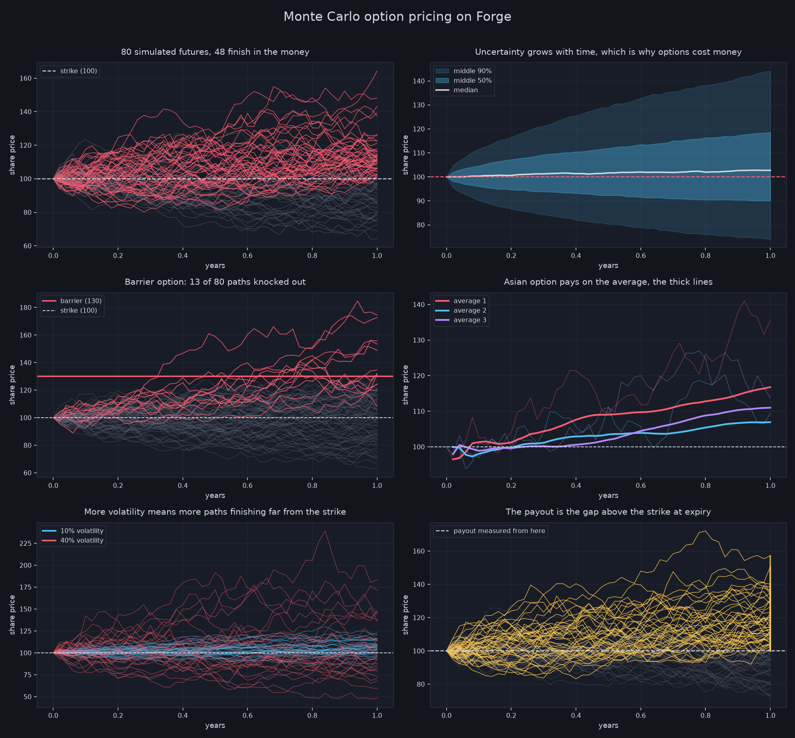
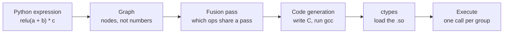

# Forge


A machine learning library written from scratch in Python, with a deep learning compiler that generates C.

No PyTorch, no TensorFlow, no NumPy in the core. Every operation, from the autograd engine to the attention mechanism, is implemented from first principles. The compiler on top of it analyses computation graphs, fuses operations, and emits optimised C at run time.

---

## What is here

**A differentiable tensor library.** Reverse-mode automatic differentiation on a define-by-run graph, a typed memory backend, and broadcasting that follows NumPy semantics without depending on NumPy.

**A neural network framework.** A `Module` system with automatic parameter registration, layers, optimisers, and loss functions.

**A decoder-only transformer.** Multi-head causal self-attention, LayerNorm, GELU, learned positional encoding, and pre-norm residual blocks, all built on the autograd engine above and gradient-checked individually.

**Hardware backends.** Matrix multiplication dispatches to the Apple Metal GPU, to Apple Accelerate BLAS on the CPU, or to a pure Python fallback, chosen by problem size.

**A deep learning compiler.** A separate front end that builds a graph, plans operator fusion, generates C source, compiles it with gcc, and loads it back through ctypes.

**Monte Carlo option pricing.** Derivatives priced on the tensor library, including the random number generation, and checked against the closed-form answers where those exist.

---

## Results

### Shakespeare

A 550,977-parameter GPT trained on the 1.11M-character tinyshakespeare corpus, using data-parallel training across 8 CPU cores.

| | |
|---|---|
| Model | 4 layers, 4 heads, 128 dimensions |
| Training | 33,113 steps, roughly 8 hours |
| Loss | 3.66 to 1.44 (character-level cross-entropy) |

The model learns Shakespeare's structure and register from raw characters, with no hand-coded rules:

```
ROMEO:
You will make him to her hell fame:
Be false and by the news of him.
Thou hast not late with my loath oCld,

NORTHUMBERLAND:
To the likely faint with my name are whose inecius:
I cannot know your grace; I and my heart!
```

It learned the style, not the meaning. Words wander and lines do not resolve, which is the honest ceiling for a model this size. Real coherence needs roughly two orders of magnitude more parameters.

<details>
<summary><b>Watch it learn</b></summary>

Samples taken during the run, showing what the model had worked out at each point. Nothing about play structure was ever specified.

**Step 1,000.** Letter frequencies and word lengths. No words.

```
Nos sor nore and thee. Kacefrar, sand a air to a trimeng ow brage;
Be cives'd suee ie fie icires eater,
```

**Step 2,000.** It discovers that plays have named speakers, and invents one.

```
OLIZABETH:
The heave in withat's mairest shis shalll weere pooosinessour centery
```

**Step 3,000.** Reaching for a real character name, and nearly getting there.

```
CORIONUS:
What you sumbled?
```

**Step 33,113.** Real speakers, verse structure, archaic register.

```
ROMEO:
You will make him to her hell fame:
Be false and by the news of him.
```

</details>

### Option pricing

A call option pays the amount a share finishes above an agreed level $K$, and nothing if it finishes below:

$$\Phi(S_T) = \max(S_T - K, 0) = (S_T - K)^{+} = \mathrm{ReLU}(S_T - K)$$

The payoff *is* the rectifier. The same function that keeps gradients alive in a neural network is the one that determines what a derivative pays, so the whole pricing routine runs as a chain of tensor operations the library already had.

Under the risk-neutral measure $\mathbb{Q}$ the price today is a discounted expectation,

$$V_0 = e^{-rT}\mathbb{E}^{\mathbb{Q}}\left[\Phi(S)\right]$$

and the share is modelled by geometric Brownian motion,

$$dS_t = rS_tdt + \sigma S_tdW_t$$

Applying Itô's lemma to $\ln S_t$ removes the state dependence and integrates exactly, giving

$$S_T = S_0 \exp\left[\left(r - \tfrac{1}{2}\sigma^{2}\right)T + \sigma\sqrt{T}Z\right], \qquad Z \sim \mathcal{N}(0,1)$$

The $-\tfrac{1}{2}\sigma^2$ term is the Itô correction, and it is what makes $\mathbb{E}[S_T] = S_0 e^{rT}$ rather than something larger.

The expectation is then estimated by simulation. Draw $n$ independent $Z^{(i)}$, evaluate the payoff on each resulting path, and average:

$$\hat{V}_n = \frac{e^{-rT}}{n}\sum_{i=1}^{n} \Phi\left(S_T^{(i)}\right)$$

By the strong law of large numbers $\hat{V}_n \to V_0$ almost surely, and by the central limit theorem the error is

$$\hat{V}_n - V_0 \sim \mathcal{N}\left(0, \frac{\sigma_\Phi^{2}}{n}\right), \qquad \mathrm{SE}(\hat{V}_n) = \frac{\sigma_\Phi}{\sqrt{n}} = O\left(n^{-1/2}\right)$$

so a hundredfold increase in paths buys roughly a tenfold reduction in error, and the convergence table below shows exactly that. Note the rate is independent of dimension, which is why simulation remains viable for payoffs where deterministic quadrature does not.

Normal draws come from the Box-Muller transform, since the library has no dependency that provides them. From two independent uniforms $U_1, U_2 \sim \mathcal{U}(0,1)$,

$$Z_0 = \sqrt{-2\ln U_1}\cos(2\pi U_2), \qquad Z_1 = \sqrt{-2\ln U_1}\sin(2\pi U_2)$$

are independent standard normals. The construction is the polar form of the Gaussian: $R^2 = -2\ln U_1$ is exponential with mean 2, which is precisely the $\chi^2_2$ distribution of $Z_0^2 + Z_1^2$, and the angle is uniform. Both outputs are kept, halving the work.

Variance is reduced further by antithetic variates, pairing each draw with its reflection:

$$\hat{V}^{\text{anti}} = \frac{1}{2}\left[\Phi(Z) + \Phi(-Z)\right], \qquad \mathrm{Var} = \frac{1}{2}\Big(\mathrm{Var}\Phi(Z) + \mathrm{Cov}\big(\Phi(Z),\Phi(-Z)\big)\Big)$$

Since $Z$ and $-Z$ are identically distributed the estimator stays unbiased, and because $\Phi$ is monotone the covariance term is negative, so the variance strictly falls.



Six views of 200,000 simulated futures. Red paths finish above the strike and pay out, grey ones expire worthless. The fan shows the range of outcomes widening with time, which is why an option costs anything at all. The gold bars in the last panel are the payouts themselves.

Priced with a share at 100, a strike of 100, 20% volatility, 5% interest, one year to expiry:

| Option | Simulated | Exact |
|---|---|---|
| Ordinary call | 10.4525 | 10.4506 |
| Asian, ordinary average | 5.8696 | no formula exists |
| Asian, geometric average | 5.6532 | 5.6411 |
| Barrier, knocked out at 130 | 3.8233 | no formula used |

The ordinary call has the Black-Scholes closed form

$$C = S_0\Phi(d_1) - K e^{-rT}\Phi(d_2), \qquad d_{1,2} = \frac{\ln(S_0/K) + \left(r \pm \tfrac{1}{2}\sigma^{2}\right)T}{\sigma\sqrt{T}}$$

with $\Phi$ the standard normal CDF. The implementation satisfies put-call parity, $C - P = S_0 - Ke^{-rT}$, to machine precision, which is an independent check that does not rely on the simulation at all.

**The exotics.** These depend on the whole path $\lbrace S_{t_1},\dots,S_{t_m} \rbrace$ rather than only $S_T$, which is why closed forms largely stop existing. The arithmetic and geometric Asian payoffs are

$$\Phi_{\text{ari}} = \left(\frac{1}{m}\sum_{j=1}^{m} S_{t_j} - K\right)^{+}, \qquad \Phi_{\text{geo}} = \left(\Big(\prod_{j=1}^{m} S_{t_j}\Big)^{1/m} - K\right)^{+} = \left(\exp\Big[\tfrac{1}{m}\textstyle\sum_j \ln S_{t_j}\Big] - K\right)^{+}$$

and the up-and-out barrier payoff is

$$\Phi_{\text{bar}} = (S_T - K)^{+}\cdot\mathbf{1}\left\lbrace \max_{1\le j\le m} S_{t_j} < B \right\rbrace$$

Only the geometric Asian admits a formula, and the reason is structural: a product of lognormals is lognormal, whereas a sum of them is not. That single case is enough to validate the path simulation, after which the other two are trusted.

The measured prices obey the inequalities they must. Averaging is a contraction, so $\mathrm{Var}(\bar{S}) < \mathrm{Var}(S_T)$ and both Asian options are cheaper than the ordinary call. The AM-GM inequality $\big(\prod x_j\big)^{1/m} \le \tfrac{1}{m}\sum x_j$ forces $\Phi_{\text{geo}} \le \Phi_{\text{ari}}$ pathwise, hence the measured $5.6532$ against $5.8696$. And since $\mathbf{1}\lbrace\cdot\rbrace \le 1$ pointwise, the barrier option is dominated by the vanilla call, here at 37% of it.

### Compiler

Measured on an Apple M4 Max. Every optimised path is verified to produce output identical to the unoptimised path before it is timed.

| Optimisation | Workload | Before | After | Speedup |
|---|---|---|---|---|
| Operator fusion | 16M elements | 8.1ms | 3.4ms | 2.36x |
| Blocked, threaded matmul | 768 x 768 | 348.0ms | 3.8ms | 91.2x |
| Both, 4-layer MLP | 256 x 256 | 43.0ms | 1.3ms | 33.5x |

### How the matmul got fast

The same 2·n³ arithmetic operations throughout. Every gain came from moving memory differently, or from using more cores.

| Stage | Time | GFLOPS | This step | Cumulative |
|---|---|---|---|---|
| Naive triple loop | 349.3ms | 3 | | 1.0x |
| Loop reordering | 28.6ms | 32 | 12.2x | 12.2x |
| Cache blocking | 32.2ms | 28 | 0.89x | 10.8x |
| `restrict` | 32.2ms | 28 | 1.00x | 10.8x |
| Threading and tuning | 3.8ms | 237 | 8.4x | 91.3x |

**Loop reordering** was the single largest win, and it changed no arithmetic at all. The naive version walks down a column of the right-hand matrix, jumping a full row stride on every step, so each 64-byte cache line fetched yields one useful float out of sixteen. Swapping the loop order so the innermost loop runs contiguously fixes that, and it is worth 12x on its own.

**Cache blocking measured slightly slower** in isolation, which was not expected. At 768 x 768 a block of the right-hand matrix already fits comfortably in this machine's L2, so tiling adds loop overhead without saving any traffic. It earns its place anyway, because the tiles are what give the threads independent slices of work.

**`restrict` did nothing measurable.** It promises the compiler that the three arrays do not overlap, which sometimes unlocks reordering that aliasing would otherwise block. Here it did not, which tells us aliasing was never the constraint.

**Threading gave the remaining 8.4x.** The choice of which loop to split follows from where threads would collide: splitting the shared-dimension loop is a data race, because different values of that index accumulate into the *same* output element, which is what the `+=` means. Splitting the output-row loop is safe, because each thread owns its rows outright.

Tile size then falls out of the thread count. A larger tile means better reuse but fewer tiles, and the thread count cannot exceed the number of tiles, so dividing the matrix height by the number of threads balances the two: every thread gets one equal, contiguous slice and none sits idle. That rule reproduces both sizes found by brute-force tuning without being told them, giving 96 at m=768 and 32 at m=256.

One optimisation is missing from the table because it did not work. Hand-written NEON intrinsics for the inner loop measured **48ms against 32ms** for the plain scalar version. Clang was already auto-vectorising that loop at width 4 with an interleave of 4, and writing intrinsics constrained its scheduler more than it helped. Unrolling to four independent accumulator chains did not recover the difference either. The scalar loop is kept deliberately.

### Against BLAS

BLAS is called through NumPy. On this machine that is Apple's Accelerate, which uses hand-tuned assembly and the AMX matrix coprocessor.

| Size | Naive | Forge | BLAS | Forge GFLOPS | BLAS GFLOPS | BLAS faster by |
|---|---|---|---|---|---|---|
| 256 x 256 | 11.0ms | 0.3ms | 0.12ms | 109 | 270 | 2.5x |
| 512 x 512 | 97.1ms | 1.6ms | 0.67ms | 172 | 401 | 2.3x |
| 768 x 768 | 348.0ms | 3.9ms | 2.58ms | 234 | 351 | **1.5x** |

**234 GFLOPS against 351**, in portable C with pthreads, against hand-tuned assembly with dedicated matrix silicon behind it.

Two things stand between the two numbers. A register-blocked micro-kernel, which computes a whole output tile in registers rather than accumulating through memory, is worth perhaps 1.3x and is genuinely available. The AMX matrix units are not: Apple never published how to address them, so no portable C can reach them at all. Part of that 1.5x is not closable from here.

---

## Quick start

```bash
pip install forge-dl
```

Python 3.10 or later. The core library has no dependencies. 

Optional extras:
`pip install -e ".[plots]"` for the option pricing charts, `".[bench]"` for the
compiler's BLAS comparison, `".[metal]"` for the Apple GPU backend.

### Tensors and gradients

```python
from forge import Tensor

a = Tensor([[1.0, 2.0], [3.0, 4.0]])
b = Tensor([[5.0, 6.0], [7.0, 8.0]])

print(a + b)      # element-wise addition
print(a @ b)      # matrix multiplication
print(a.T)        # transpose

x = Tensor([2.0, 3.0], requires_grad=True)
y = ((x * x) + x).sum()
y.backward()
print(x.grad)     # dy/dx = 2x + 1
```

### A GPT

```python
from forge.nn import GPT
from forge.nn import CrossEntropyLoss
from forge.optim import Adam

model = GPT(vocab_size=65, embed_dim=128, num_heads=4,
            ff_dim=256, num_layers=4, seq_len=32)
criterion = CrossEntropyLoss()
optimizer = Adam(model.parameters(), lr=0.002)

logits = model([[1, 2, 3, 4]])
loss = criterion(logits, [2, 3, 4, 5])
optimizer.zero_grad()
loss.backward()
optimizer.step()
```

### Training runs

```bash
python3 sidequests/pokemon/pokemon_names.py           # invent Pokemon names
python3 sidequests/shakespeare/train_shakespeare.py   # data-parallel Shakespeare training
python3 sidequests/shakespeare/resume_shakespeare.py  # continue from a checkpoint
```

### Option pricing

```bash
pip install matplotlib
python3 sidequests/options/price_report.py
```

Prints the convergence table and writes `prices.png`.

### The compiler

```bash
python -m forge.compiler.build
python forge/compiler/benchmark.py
```

---

## How it works

### Automatic differentiation

Every operation records itself in a graph as it runs. Calling `backward()` walks that graph in reverse topological order, applying the chain rule at each node and accumulating gradients into the leaves.

For a scalar loss $L$ and a node $x$ feeding consumers $y_1, \dots, y_m$, reverse mode accumulates

$$\frac{\partial L}{\partial x} = \sum_{j=1}^{m} \frac{\partial L}{\partial y_j}\frac{\partial y_j}{\partial x}$$

Each `Function` supplies only the local Jacobian-vector product $\bar{y} \mapsto \bar{y}\partial y/\partial x$, never the full Jacobian. For a graph with $V$ nodes the whole backward pass costs $O(V)$ and evaluates $\nabla L$ for every parameter simultaneously, which is the property that makes training feasible at all.

Adding a new differentiable operation means subclassing `Function` and writing `forward` and `backward`. Anything composed from existing operations gets its gradient for free, which is why `LayerNorm` has no backward method of its own.

### Gradient verification

Every operation is checked against a numerical gradient computed by central finite differences:

```python
from forge.autograd import grad_check
from forge.dtype import float64

def mse(pred):
    target = Tensor([1.0, 2.0, 3.0], dtype=float64)
    return ((pred - target) ** 2).mean()

pred = Tensor([1.5, 2.5, 3.5], dtype=float64, requires_grad=True)
assert grad_check(mse, [pred])
```

The check compares the analytical gradient against the central difference

$$\frac{\partial f}{\partial x_i} \approx \frac{f(\mathbf{x} + h\mathbf{e}_i) - f(\mathbf{x} - h\mathbf{e}_i)}{2h}$$

Expanding both terms as Taylor series about $\mathbf{x}$ cancels the even-order terms, leaving truncation error $O(h^2)$ against $O(h)$ for the one-sided difference $\left(f(x+h)-f(x)\right)/h$. Against that, floating-point cancellation contributes roughly $O(\varepsilon_{\text{mach}}/h)$, so total error is minimised near $h \sim \varepsilon_{\text{mach}}^{1/3}$. The implementation uses $h = 10^{-3}$ with a relative tolerance of $10^{-2}$, and runs in float64 so that float32 rounding does not produce false failures.

This caught a bug where a manual tensor slice in the attention path had silently detached the embedding layer from the graph. The model trained, the loss fell, and the embedding never moved.

### The transformer

Each block is pre-norm with residual connections, so for a block $\ell$

$$h' = h + \mathrm{MHA}\left(\mathrm{LN}(h)\right), \qquad h_{\ell+1} = h' + W_2\mathrm{GELU}\left(W_1\mathrm{LN}(h')\right)$$

Writing it as $h_{\ell+1} = h_\ell + F(h_\ell)$ makes the reason for residuals explicit: since $\partial h_{\ell+1}/\partial h_\ell = I + \partial F/\partial h_\ell$, the gradient reaching layer $\ell$ from layer $L$ is

$$\frac{\partial L}{\partial h_\ell} = \frac{\partial L}{\partial h_L}\prod_{j=\ell}^{L-1}\left(I + \frac{\partial F_j}{\partial h_j}\right)$$

The identity term keeps that product from collapsing to zero, which is what makes depth trainable.

**Attention.** With $Q = XW_Q$, $K = XW_K$, $V = XW_V$ projected to $d_k = d_{\text{model}}/h$ per head,

$$\mathrm{Attention}(Q,K,V) = \mathrm{softmax}\left(\frac{QK^{\top}}{\sqrt{d_k}} + M\right)V, \qquad M_{ij} = \begin{cases} 0 & j \le i \cr -\infty & j > i \end{cases}$$

The scaling by $\sqrt{d_k}$ is not cosmetic. If the entries of $q$ and $k$ are independent with mean $0$ and variance $1$, then $\mathrm{Var}(q \cdot k) = d_k$, so without the division the logits grow like $\sqrt{d_k}$ and push softmax into a regime where its Jacobian vanishes. Dividing restores unit variance.

The mask $M$ is what makes the model causal: setting future logits to $-\infty$ sends their softmax weights to exactly zero, so position $i$ can attend only to $j \le i$. In practice $-10^{30}$ is used rather than true $-\infty$, because the stable softmax below would otherwise evaluate $-\infty - (-\infty)$ and produce NaN.

**Softmax**, evaluated in the shift-invariant form

$$\mathrm{softmax}(x)_i = \frac{\exp(x_i - \max_j x_j)}{\sum_k \exp(x_k - \max_j x_j)}$$

which is algebraically identical to the naive form but never overflows, since every exponent is at most $0$.

**LayerNorm**, over the $d$ features of a single row,

$$\mathrm{LN}(x)_i = \gamma_i\frac{x_i - \mu}{\sqrt{\sigma^2 + \epsilon}} + \beta_i, \qquad \mu = \frac{1}{d}\sum_{j=1}^{d} x_j, \quad \sigma^2 = \frac{1}{d}\sum_{j=1}^{d}(x_j - \mu)^2$$

with $\epsilon = 10^{-5}$ guarding the degenerate case $\sigma^2 = 0$. Note that $\mathrm{LN}$ has no hand-written backward pass in this library: it is composed entirely from differentiable primitives, so the engine derives $\partial\mathrm{LN}/\partial x$ by the chain rule alone.

**GELU**, in the tanh approximation

$$\mathrm{GELU}(x) = \frac{1}{2}x\left(1 + \tanh\left[\sqrt{\tfrac{2}{\pi}}\left(x + 0.044715x^{3}\right)\right]\right)$$

approximating the exact $x\Phi(x)$ to within $4.7 \times 10^{-4}$ on $[-4, 4]$. Unlike $\mathrm{ReLU}$, it is smooth everywhere, so no unit has identically zero gradient.

**Objective.** Training minimises the mean cross-entropy over the $T$ positions of a sequence,

$$\mathcal{L} = -\frac{1}{T}\sum_{t=1}^{T} \log p_{t,y_t}, \qquad p_t = \mathrm{softmax}(z_t)$$

**Adam** then updates each parameter by

$$m_t = \beta_1 m_{t-1} + (1-\beta_1)g_t, \qquad v_t = \beta_2 v_{t-1} + (1-\beta_2)g_t^{2}$$

$$\hat{m}_t = \frac{m_t}{1-\beta_1^{t}}, \qquad \hat{v}_t = \frac{v_t}{1-\beta_2^{t}}, \qquad \theta_t = \theta_{t-1} - \alpha\frac{\hat{m}_t}{\sqrt{\hat{v}_t} + \epsilon}$$

The bias correction matters most early on: $m_0 = v_0 = 0$ biases the raw moments toward zero, and dividing by $1 - \beta^{t}$ removes exactly that bias.

### Matrix multiplication backends

For $A \in \mathbb{R}^{m \times k}$ and $B \in \mathbb{R}^{k \times n}$ the product is

$$C_{ij} = \sum_{p=0}^{k-1} A_{ip} B_{pj}, \qquad C \in \mathbb{R}^{m \times n}$$

costing $2mnk$ floating-point operations. Tensors are stored flat and row-major, so each matrix carries its own stride equal to its column count:

$$A_{ip} \mapsto A[ik + p], \qquad B_{pj} \mapsto B[pn + j], \qquad C_{ij} \mapsto C[in + j]$$

Using the wrong stride is invisible when $m = k = n$, because all three coincide. That is exactly how two stride bugs survived a square test suite.

Matmul picks a path by problem size:

| Condition | Backend |
|---|---|
| float32, above the work threshold | Apple Metal GPU, through MPSMatrixMultiplication |
| float32, below it | Apple Accelerate BLAS, through cblas_sgemm |
| anything else | pure Python triple loop |

The threshold exists because GPU dispatch has a fixed setup cost. For the small matrices in a character-level model, that cost is larger than the multiplication itself, so the GPU is slower than the CPU. The library measures the work and routes accordingly.

### The compiler



Five stages, each in its own file under `forge/compiler/`:

| Stage | File | What it does |
|---|---|---|
| Graph | `graph.py` | Records operations as nodes instead of executing them |
| Interpreter | `interpreter.py` | Runs the graph one node at a time, as a baseline |
| Fusion | `fusion.py` | Groups element-wise chains that can share one memory pass |
| Code generation | `codegen.py` | Writes C for each group, compiles it, loads it |
| Execution | `compiled_run.py` | Runs the compiled plan |

The fusion rule is that an intermediate can be absorbed into a group only if exactly one operation consumes it. A value read in two places has to exist in memory, so it cannot dissolve into a register.

For `relu(a + b) * c` the compiler writes this, and nothing else in the project wrote it:

```c
void fused_kernel(const float* in0, const float* in1, const float* in2,
                  float* out, int n){
    for (int i = 0; i < n; i++) {
        float t3 = (in0[i] + in1[i]);
        float t4 = (t3 > 0.0f ? t3 : 0.0f);
        out[i] = (t4 * in2[i]);
    }
}
```

Three kernels become one. Three passes over memory become one. The intermediates `t3` and `t4` live in registers and never reach main memory.

**Why fusion helps, precisely.** Consider a chain of $g$ element-wise operations over tensors of $N$ elements. Executed one at a time, each operation reads its inputs and writes a full intermediate, so the memory traffic is

$$Q_{\text{unfused}} = \Theta(gN) \text{ words}$$

Fused into a single loop, every intermediate lives in a register and only the true inputs and the final output touch memory:

$$Q_{\text{fused}} = \Theta(N) \text{ words}$$

The arithmetic is unchanged at $\Theta(gN)$ flops in both cases. What rises is the arithmetic intensity

$$I = \frac{\text{flops}}{\text{bytes moved}}, \qquad I_{\text{fused}} \approx g \cdot I_{\text{unfused}}$$

By the roofline model, attainable performance is $\min(\pi, I \cdot \beta)$ for peak compute $\pi$ and memory bandwidth $\beta$. Element-wise work sits far to the left of the ridge point $I^{*} = \pi/\beta$, so it is bandwidth-bound and multiplying $I$ by $g$ translates directly into speed. This also predicts the measured behaviour: while the working set fits in cache the effective $\beta$ is large and fusion barely matters, and the benefit only appears once the arrays exceed cache.

**Why blocking helps.** Cache blocking does not change the $\Theta(mnk)$ operation count at all. With a tile of size $b$ chosen so that $3b^2 \le M$ for cache size $M$, the classic bound of Hong and Kung gives compulsory traffic

$$Q_{\text{blocked}} = \Theta\left(\frac{mnk}{\sqrt{M}}\right)$$

against $\Theta(mnk)$ for the naive triple loop, an improvement of $\Theta(\sqrt{M})$ in traffic while the flop count stays fixed.

Neither transformation improves asymptotic time complexity. Both are constant-factor improvements in the memory hierarchy, and on modern hardware that is where the performance is, because arithmetic is rarely the limit.

---

## Bugs worth knowing about

Building this from scratch meant every bug was mine to find. Three were instructive enough to write down.

<details>
<summary><b>The embedding layer that never trained</b></summary>

Training ran, loss fell, output improved. The embedding weights never moved.

A manual tensor slice in the attention path was copying values into a fresh tensor rather than going through a tracked operation. The autograd graph was severed at that point, so gradients flowing backwards stopped there and never reached the embedding. The rest of the network compensated well enough to hide it.

Nothing about the training curve suggested a problem. It surfaced only when checking whether every layer was actually receiving a gradient, and the embedding's was empty. The fix was making the slice a proper differentiable operation.

</details>

<details>
<summary><b>The model obsessed with the letter Z</b></summary>

A name generator trained on 1,024 Pokemon names produced almost exclusively names beginning with Z.

The cause was not the model. The training data was sorted alphabetically and never shuffled, so every epoch ended on the z-names and the final gradient steps of each pass pulled the weights toward z openings. Over twenty epochs that bias compounded.

An earlier run on the first 500 names, which end around m, showed the same effect with different letters, which is what identified it. Shuffling the order each epoch fixed it in one line.

</details>

<details>
<summary><b>The matmul that only worked on square matrices</b></summary>

Flat array indexing means each matrix has its own row stride, and that stride is its own column count. Using the wrong one reads the wrong values, or reads past the end of the array.

Square test data hides this completely, because when every dimension is equal, every stride is the same number. Two separate stride bugs passed all the square tests and produced values around 1e35 on the first non-square input.

The test suite now uses deliberately non-square shapes such as 2x3 @ 3x4, where all three dimensions differ.

</details>

<details>
<summary><b>The subtraction that ran backwards</b></summary>

Pricing a barrier option needs a flag that is 1 for paths which survived and 0 for those knocked out. The obvious way to write it is `1.0 - breached`.

That returned the wrong sign, and the option came out with a negative price.

When Python evaluates `1.0 - tensor`, the float does not know how to subtract a tensor, so it hands the job back to the tensor through `__rsub__`. The implementation computed `self - other` rather than `other - self`, silently reversing the operands. Addition and multiplication were unaffected because they commute, so only subtraction and division could expose it.

The lesson is that reflected operators are the one place where writing the obvious implementation gives the wrong answer, precisely because the arguments arrive swapped.

</details>

## Design decisions

**Typed arrays over Python lists.** A Python float object costs 24 bytes. A float32 in an `array` costs 4. For a model with hundreds of thousands of parameters that ratio matters.

**Define-by-run for the library, define-then-run for the compiler.** The library builds its graph as operations execute, which allows ordinary Python control flow in a forward pass. The compiler needs the opposite, because it has to see the whole computation before anything runs in order to find work worth fusing.

**Per-head projections in multi-head attention.** The standard implementation makes one large projection and reshapes it into heads. Reshape in this library does not preserve gradients, so each head has its own smaller Query, Key and Value layers instead. Mathematically identical, and every step stays differentiable.

**A large negative number instead of negative infinity in the causal mask.** Softmax subtracts the row maximum for numerical stability. With true negative infinity that subtraction produces NaN. Using -1e30 gives the same effect without the arithmetic hazard.

---

## Limitations

The core library is pure Python, so it is orders of magnitude slower than a production framework. That is the point of the exercise, but it is worth stating plainly.

The GPT processes one sequence at a time. Batching was implemented and verified but is not in this branch.

The compiler handles the forward pass over six operations, with no autograd. Only matmul is threaded; the element-wise kernels are single-threaded, which is fine because they are memory-bound rather than compute-bound.

Metal and Accelerate backends require macOS and PyObjC. Everything falls back to pure Python elsewhere.

---

## Repository layout

```
forge/
  tensor.py               Tensor class, broadcasting, operator overloading
  dtype.py                float32 and float64 definitions
  serialization.py        save and load weights

  autograd/
    engine.py             Function base class, the autograd core
    operations.py         differentiable operations and their gradients
    grad_check.py         numerical gradient verification
    fusion.py             graph-level Linear plus ReLU fusion
    mps_backend.py        Apple Metal GPU matmul
    accelerate_backend.py Apple Accelerate BLAS matmul

  nn/
    module.py             Module base class, parameter registration
    layers.py             Linear, Embedding, LayerNorm, MultiHeadAttention, GPT
    losses.py             MSE, BCE, CrossEntropy
    parameter.py          trainable tensor wrapper

  optim/
    optimizer.py          SGD with momentum, Adam

  compiler/
    graph.py              computation graph representation
    fusion.py             fusion planning pass
    codegen.py            C source generation and run-time compilation
    interpreter.py        baseline node-by-node execution
    compiled_run.py       compiled plan execution
    kernels.c             hand-written C kernels, including blocked matmul
    build.py              builds kernels.so
    benchmark.py          performance measurement

sidequests/
  shakespeare/
    train_shakespeare.py  data-parallel training across CPU cores
    resume_shakespeare.py continue training from a checkpoint
  pokemon/
    pokemon_names.py      character-level name generation
  options/
    options.py            Black-Scholes, Monte Carlo, Asian and barrier pricing
    price_report.py       convergence table and charts
```

---

Built by **Srihari Srinivasan**, with love :).

[LinkedIn](https://linkedin.com/in/sriharisrini)